= 🤖 De l’ignorance à la dépendance : Comment l’IA a changé ma façon de coder ? 🧑‍💻 
:source-highlighter: highlightjs
:revealjs_theme: white
:revealjs_history: true
:revealjs_plugin_pdf: enabled
:revealjs_plugin_highlight: enabled
:revealjs_progress: true
:customcss: custom.css
:data-uri:
:icons: font

++++

@binout

++++

== ℹ️ Disclaimer

image::images/{conf}-background.png[background, size=cover]

* Pas de comparaison d'assistances de code
* Pas d'explication approfondie de l'IA
* Juste un retour personnel

== Benoit Prioux

image::images/{conf}-background.png[background, size=cover]

icon:twitter[] icon:github[] binout 

image::images/alan-eng.jpeg[]

== 💜 Alan, partenaire santé

image::images/{conf}-background.png[background, size=cover]

image:images/Alan-1.png[width=25%]

image:images/Alan-2.png[width=25%]

== 🧑‍💻 IA chez Alan

image::images/{conf}-background.png[background, size=cover]

Charles Gorintin - CTO
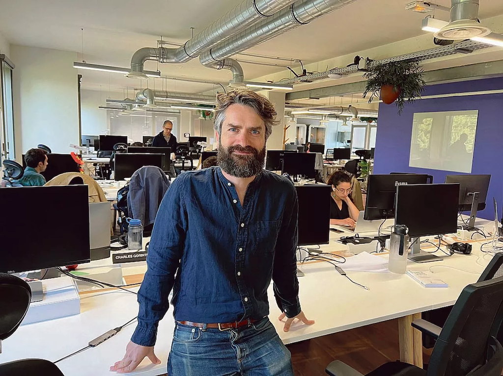

== 🚀 Novembre 2021

image::images/{conf}-background.png[background, size=cover]

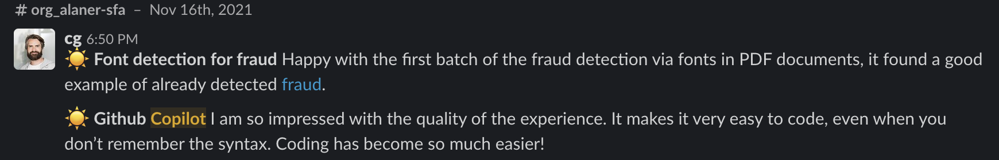

== ⚙️ Github Copilot

image::images/{conf}-background.png[background, size=cover]

image:images/copilot.png[]

https://medium.com/analytics-vidhya/github-copilot-all-you-need-to-know-8e6fc1d5ccc[Source]

== 🙅‍♂️ Pas pour moi

image::images/{conf}-background.png[background, size=cover]

* “trop senior pour être utile”
* “du code généré mais de mauvaise qualité
* “marche que pour des hello words”

== 😨 24 mois plus tard

image::images/{conf}-background.png[background, size=cover]

“oh non ma subscription à Copilot n’a pas été renouvelée, j’en ai trop besoin”

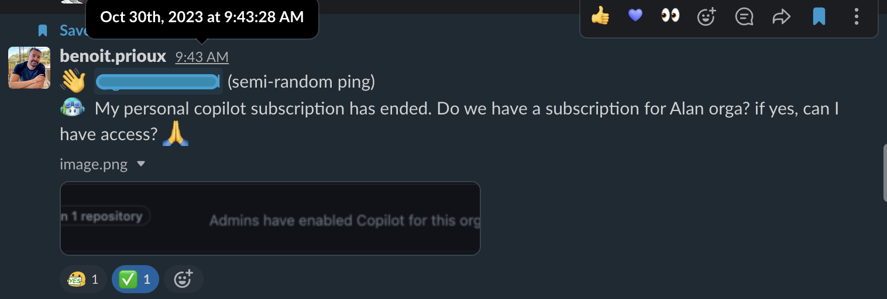

== 🗓️ Timeline, Gitbub Copilot

image::images/{conf}-background.png[background, size=cover]

* Nov 2021 : 🥇 Démo
* Nov 2021 -> Octobre 2002 : 🗣️ 🤔
* 30 octobre 2022: 🥇 Installation - PyCharm / VsCode
* 30 octobre 2023: 🚀 Renouvellement souscription

== 😤 Premier contact 

image::images/{conf}-background.png[background, size=cover]

* Complétion un peu trop intrusive
* Ralentit mon "rythme" de travail
* Pas confiance dans la suggestion

== 🧐 Et puis, parfois c'est pas mal 

image::images/{conf}-background.png[background, size=cover]

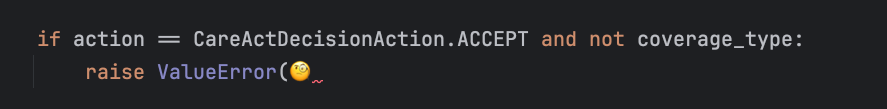

== 🤩 Ecrire un message d'erreur 

image::images/{conf}-background.png[background, size=cover]

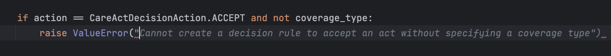

== 😎 Ecrire un message de log

image::images/{conf}-background.png[background, size=cover]

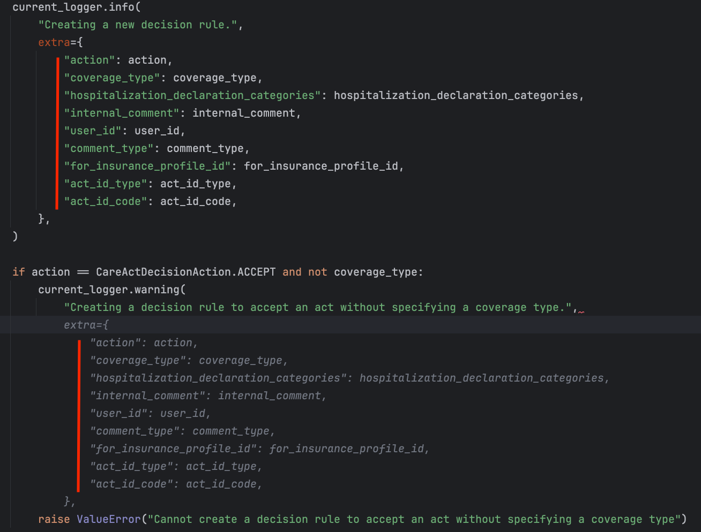

== 💡 Et si c'est à moi de m'adapter?

image::images/{conf}-background.png[background, size=cover]

* Comment aider Copilot à être plus pertinent ?
* Comment maximiser la connaissance du contexte de Copilot ?

== 🤓 Tip: Utiliser les commentaires

image::images/{conf}-background.png[background, size=cover]

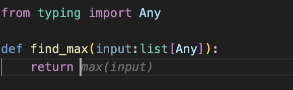

== 🤓 Tip: Utiliser les commentaires

image::images/{conf}-background.png[background, size=cover]

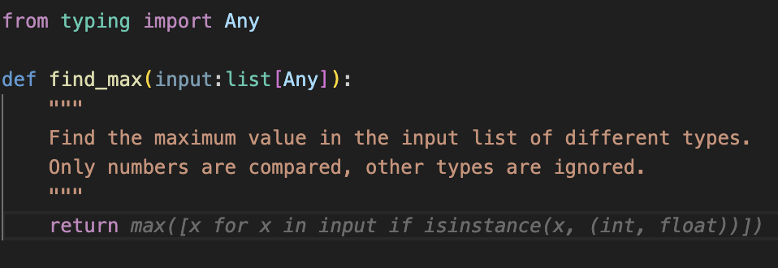

== 🤓 Tip: Utiliser les commentaires pour copilot

image::images/{conf}-background.png[background, size=cover]

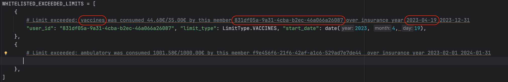

== 🤓 Tip: Utiliser les commentaires pour copilot

image::images/{conf}-background.png[background, size=cover]

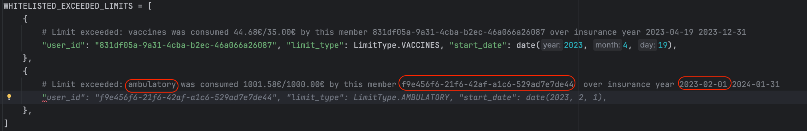

== 🤓 Tip: Code homogène

image::images/{conf}-background.png[background, size=cover]

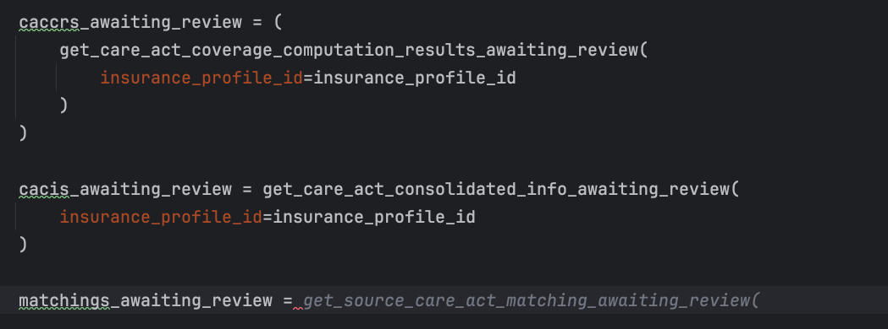

== 🤓 Tip: Code homogène

image::images/{conf}-background.png[background, size=cover]

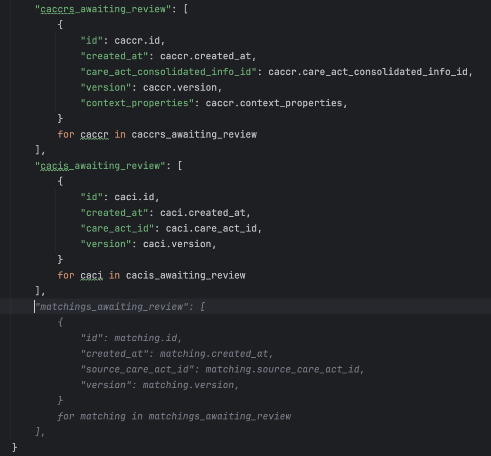

== 🤓 Tip: Nommage

image::images/{conf}-background.png[background, size=cover]

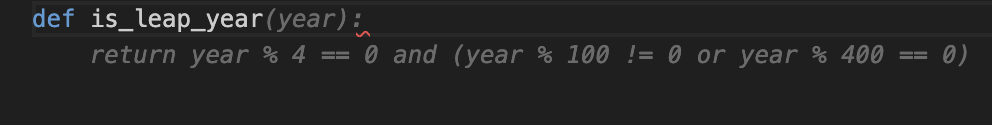

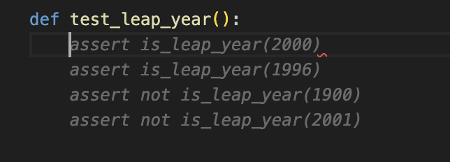

== 😎 Aujourd'hui

image::images/{conf}-background.png[background, size=cover]

🧰 Indispensable dans ma boite à outils de développeur

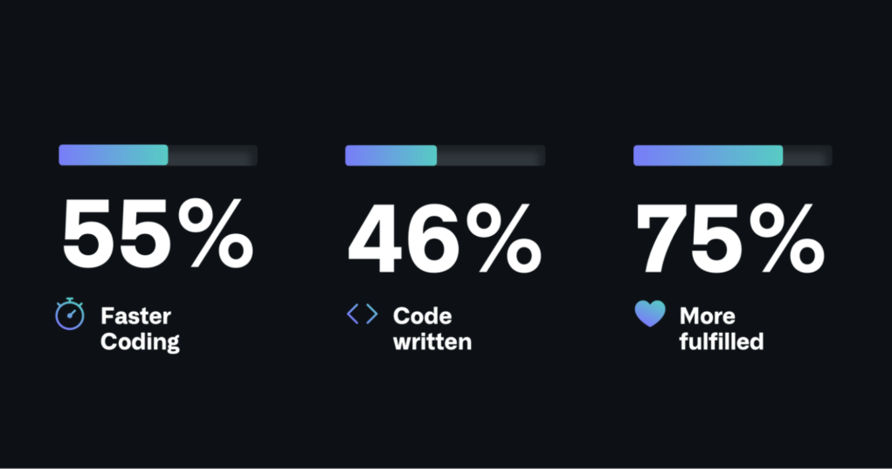

https://github.blog/2023-06-27-the-economic-impact-of-the-ai-powered-developer-lifecycle-and-lessons-from-github-copilot/[Source]

== 🤩 Et pas que le code

image::images/{conf}-background.png[background, size=cover]

💁 Ecriture des peer reviews

* 🏆 Un fichier avec le "Summary of achievement"
* 🗂️ Un fichier avec la grille d'évaluation
* ✍️ Un fichier pour écrire la review

== Merci 🙏

image::images/{conf}-background.png[background, size=cover]

👨‍🏫 https://binout.github.io/ai-dev-xp/

image::images/marmot.png[width=20%]

➡️ https://alan.com/careers

